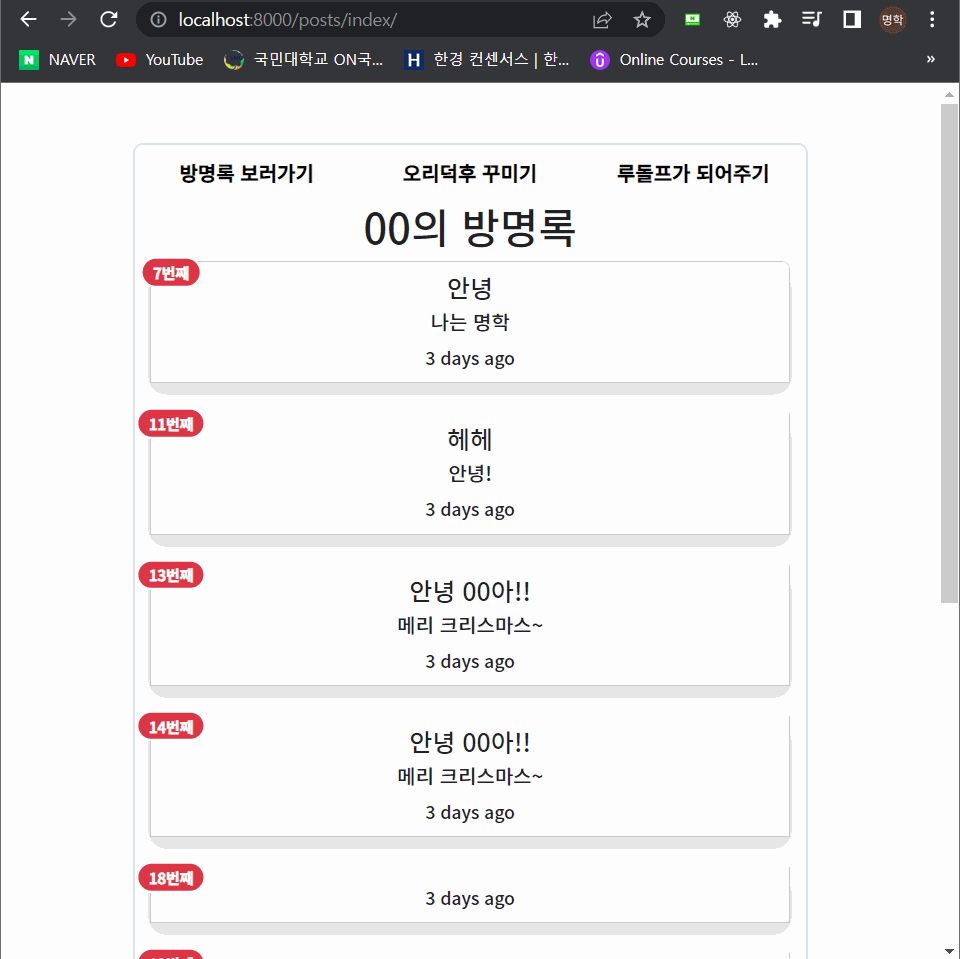
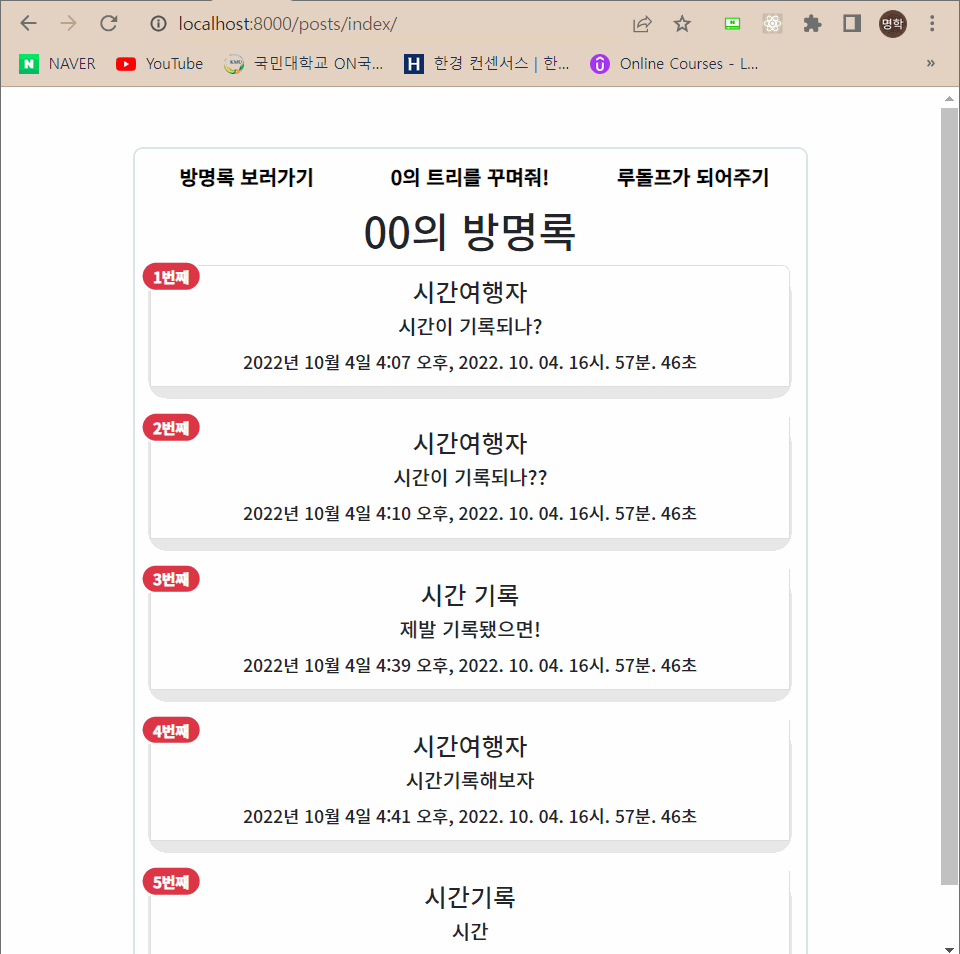
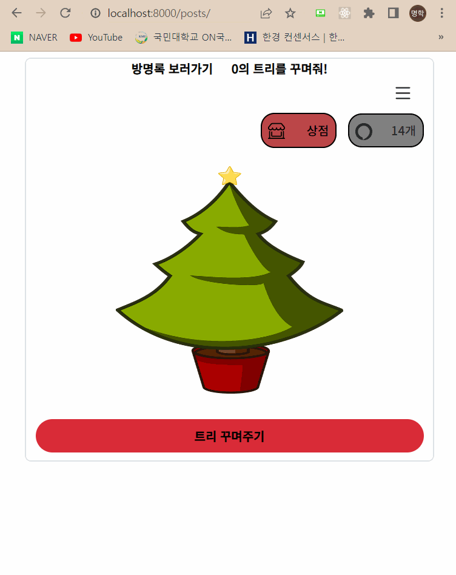
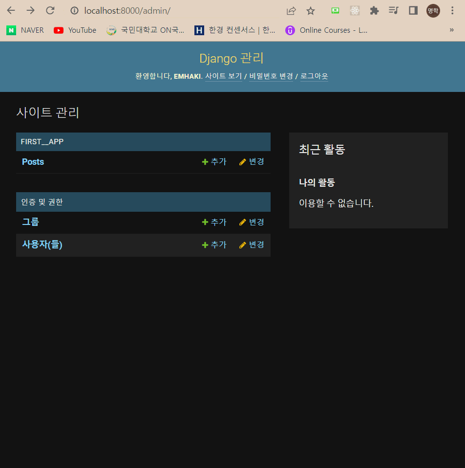
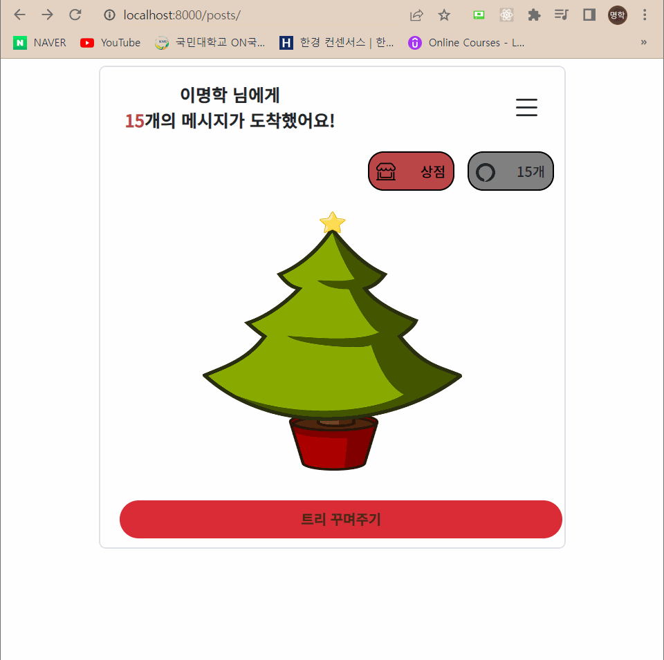
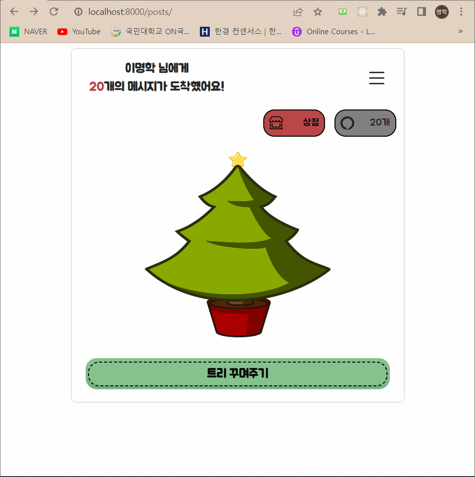
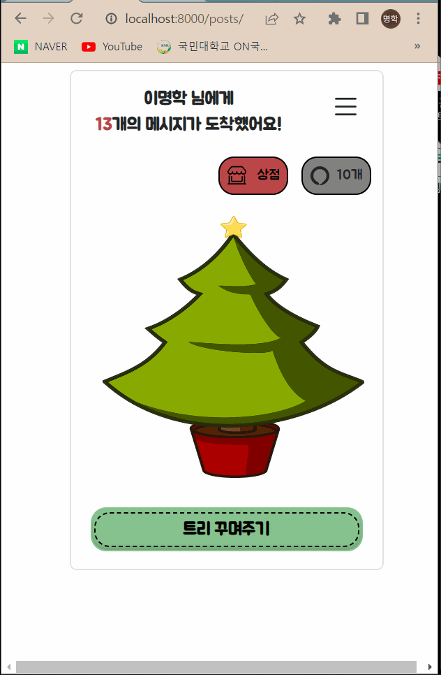
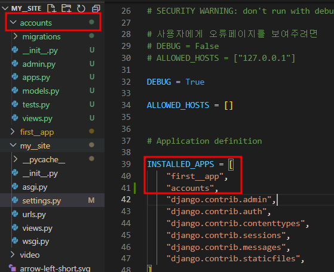
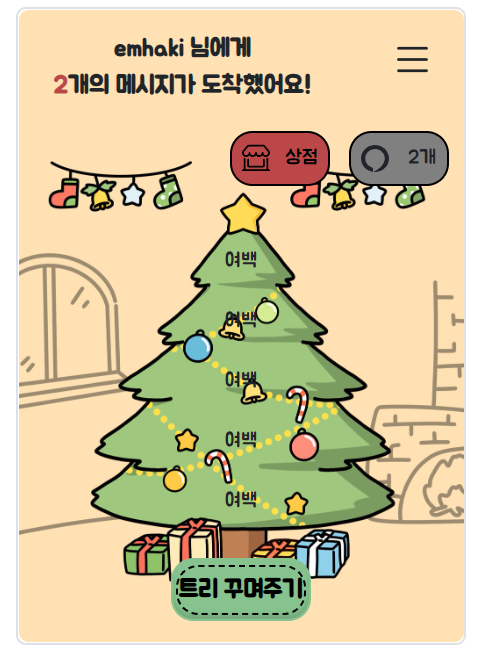

# 9/29

# [Django] CRUD 📝


## 🔎 구현한 기술

1. index, create, edit, detail, delete, new HTML 생성 후 urls과 맵핑.
2. 함수정의 방식으로 views.py에서 각 HTML에서 사용할 기능들을 구현
3. DB에 있는 pk 데이터를 통해 id값을 찾고, get을 통해서 데이터를 조작
4. delete의 경우 화면을 다시 보여줄 필요 없으니 redirect를 통해서 render의 과정을 줄임
5. base.html을 설정하여 다른 HTML에게 extends 함

# 10/1


## 🔎 구현한 기술

1. bootstrap으로 grid 설정
2. 사용자 id(pk)값을 position:relative와 absolute를 통해 몇번째로 작성했는지 구현
3. 사용자 편의성을 위해 box 전체를 링크태그로 설정

## 👨‍💻 다음에 구현해야 하는 것

1. 작성 후 작성완료 페이지를 안보여주고 바로 redirect를 통해서 사용자 방명록 페이지로 보이게끔 하기
2. 수정과 삭제 기능을 구현할까 고민중
3. 메인 페이지를 구현해야 함
4. 마우스 hover효과 추가와 각 글들에게 그림자 효과 (큰 테두리는 없앨까 고민중)
5. 글이 일정글 이상 많아지면 페이지 처리
6. 며칠전에 적었는지 시간 보여주기 (구현 고민중, 구현한다면 수정기능을 없애야 할수도)

# 10/2

## 🔎 구현한 기술

1. Static 파일을 하나 만들어서 Django와 CSS를 연결 /  을 사용하고 Setting에서 설정해줘야 CSS적용이 된다는 점을 깨달음
2. creat.html에 placeholder와 디자인적인 요소들 추가.
3. 마우스 호버시 글들이 커지게 끔 효과 삽입

## 👨‍💻 다음에 구현해야 하는 것

1. placeholder에 focus시 글자가 사라지게끔 구현
2. 기본적인 디자인적인 요소들 추가

# 10/3



## 🔎 구현한 기술

1. 404.html을 만들어서 찾을 수 없는 페이지를 보여주게끔 설계 (setting.py에서 DEBUG를 False로 변경) + 아직은 디버그를 확인하기 위해 다시 True로 변경
2. 상대방이 나에게 방명록을 작성해주면 코인이 생기게끔 구현 Post.objects.all()을 활용해 저장된 데이터에 따른 코인숫자
3. 디자인적인 요소들 추가 (button 호버, font삽입 등)

## 👨‍💻 다음에 구현해야 하는 것

1. 회원가입, 로그인 기능 추가
2. 로그인시 00의 방명록으로 보이게끔
3. main페이지 꾸미기
4. 글을 작성하면 코인을 2개 주고 방명록이 등록되면 1개씩 주는 것으로 구현해야 함
5. 상점 페이지에서 구입할 수 있게 끔 html 만들기
6. 작성완료 안보여주고 바로 방명록으로 이동시키기

# 10/4



## 🔎 구현한 기술

1. store.html을 만들고 a링크 url 설정
2. 기존 DB들을 삭제하고 생성시간을 기록할 수 있는 DB테이블을 생성해서 objects.all()을 활용해 작성시간을 보여주게끔 구현 (날짜 데이터 ui가 맘에 들지 않아 수정할 예정)
3. DB 테이블 추가하는 과정에서 시간이 꽤 걸렸다. 결국 테이블을 다 삭제하고 새로 migrate 했다. DB설계를 잘 해야함을 깨달았다.

## 👨‍💻 다음에 구현해야 하는 것

1. html단에서 required를 삭제하면 csrf 위험이 있으므로 서버단에서도 관리할 수 있도록 수정하기
2. datetime.now() 를 활용하거나 데이터 테이블에 저장된 내용을 활용해 사용자 친화적으로 만들기

# 10/5

## 🔎 구현한 기술



1. models.py에서 **from django.core.validators import MaxLengthValidator, MinLengthValidator** 설정, 제목과 내용에 유효성 검사 함수 추가
2. main 페이지에 크리스마스 트리 이미지 추가(다른 이미지로 대체 예정)
3. redirect를 이용해 사용자가 create.html에서 글을 작성하면 index페이지로 이동하게끔 설정
4. 메인페이지에서 리스트 버튼을 누르면 옆에서 offcanvas 효과 삽입
5. offcanvas에서 상세 정보와 내용 삽입

## 👨‍💻 다음에 구현해야 하는 것

1. 핸드폰, 노트북 등 다양한 viewport에 맞는 프론트 보여주게끔 설정.
2. 최악의 상황을 고려해서 코드를 짤 것.
3. base.html이 조금 단조로워 보여서 꾸미기
4. offcanvas의 디자인 꾸미기

# 10/6




## 🔎 구현한 기술

https://docs.djangoproject.com/en/4.1/ref/templates/builtins/

1. admin 추가 (python manage.py createsuperuser) admin.py에 from .models import Post를 추가하고 admin.site.register(Post)를 추가 / 어드민에서 게시글을 확인 및 조작 가능
2. 작성한 글의 시간을 Django공식 문서를 참고해서 2022-10-06 목요일 14:30 과 같이 조금 더 사용자가 보기 좋게 끔 구현
3. 각 링크와 버튼의 클릭 범위 확대(버튼에 a태그를 걸었던게 아니라 버튼안에 a태그가 있어서 클릭이 어려웠음)
4. base.html에 포스팅갯수를 카운트하기 위해 각 함수에 동일한 로직 삽입(화면이 이동해도 동일하게 보이게끔)

## 👨‍💻 다음에 구현해야 하는 것

1. 사용자의 이름이 시작점에 위치할 수 있도록(지금은 중앙정렬된 상태, div가 꼬인 것 같음)
2. detail 페이지 꾸미기

# 10/7

## 🔎 구현한 기술

1. date: date:"o-m-d D" 형식으로 작성 시간을 가시성 있게 구현
2. timesince를 이용해서 몇시간 전에 작성했는지 보여줄까 했지만, 서비스 취지에 맞지 않는 것 같아서 구현했다가 삭제
3. 외부 무료 폰트를 다운받아서 css 파일에 폰트 삽입

## 👨‍💻 다음에 구현해야 하는 것

1. 다양한 view 포트에 따른 화면 구현을 생각해볼 것
2. csrf 토큰 추가하기
3. if post와 get을 통해서 서버에서도 안정성있게 구현하기

# 10/8

## 🔎 구현한 기술

1. creat.html에 csrf 토큰 추가.
2. views.py에서도 if문을 통해 post와 get을 처리하도록 코드작성
3. 디자인적인 요소 추가
4. 카드 메시지가 일정 길이 이상 많아지면 ...으로 보이게끔 truncatewords:50 으로 설정
5. detail.html에서도 내용 글이 많아지면 정해진 box보다 넘치지 않게 overflow: auto;로 처리

## 👨‍💻 다음에 구현해야 하는 것

1. 회원가입 기능
2. 로그인 기능
3. 로그인에 따른 데이터베이스 재설정

# 10/9

## 🔎 구현한 기술



1. CSS 파일이 자꾸 실시간 적용이 되지 않아서 구글링해서 찾은 코드 css링크에 / href="?" 내용을 추가. 를 넣으면 파일 로드 파라미터로 매 초마다 Unix Timestamp를 자동적으로 생성한다고 한다. 따라서 파일 로드 태그를 붙여주면, 실제 웹 사이트 상에서는 자체적으로 생성한 파라미터를 사용해 파일을 찾게 된다.

2. 디자인적 요소 : **box-shadow: 0px -4px 4px #74aa7b inset;** 를 추가해서 버튼의 입체적 요소를 추가. box의 color보다 box-shadow의 색을 어둡게 하면 입체적인 효과가 나온다.

3. 상점에서 구매하기 버튼 클릭시 모달 생성, 모달의 id값과 data-target을 일치시켜서 원하는 내용을 출력할 수 있게끔 설계

## 👨‍💻 다음에 구현해야 하는 것

1. 상점에서 물품을 구매시 코인이 줄어들게끔 구현
2. 물품을 구매시 구매한 상품이 메인에 보이게끔 구현
3. 보유한 코인이 구매 가격보다 낮을시 구매되지 않게끔 구현

# 10/11



## 🔎 구현한 기술

1. 상점에서 물건 구매시 코인을 차감시키는 기능
2. 구현 로직

```py
1. DB의 coin = 1인 데이터 값들을 count해서 화면에 보여줌
2. 상점에서 물건을 구매(price)한 값을 로 전송.
3. views.py의 def main(request) 함수에서
if request.method == "POST" and request.POST.get("price") 로직을 구성.
4. Post.objects.order_by("coin").values()[0]을 c 라는 변수에 할당
5. for k, v in c.items():
  if k == 'id':
    id_key = c[k]
를 통해서 id_key의 id값을 저장
6. post = Post.objects.get(id=id_key)를 통해 원하는 데이터 값을 변경준비
7. post.coin = 2 를 통해 기존에 coin = 1이었던 DB값을 2로 변경
8. post.save()를 통해 DB저장

그리고 coin = Post.objects.filter(coin=1).count()로 설정해서 현재 가지고 있는 코인을 출력
```

## 👨‍💻 구현하면서 어려웠던 점

1. 머릿속으로는 간단한 기능이라고 생각했는데 이틀이라는 시간이 걸렸다. 처음에는 DB를 건드리지 않으면서 변수 저장을 통해 렌더링을 하려고 했으나, 페이지를 새로고침할 때마다 새롭게 함수가 실행되다보니 코인을 차감해도 리셋이 되었다.
2. 때문에 DB를 건드릴 수 밖에 없다고 생각했고, ORM querySet을 통해서 변경하기 위한 과정을 거쳤다.
3. ORM과 querySet 개념이 약하다보니, 시행착오를 많이 겪었고, 딕셔너리의 items를 통해서 변경하고자 하는 데이터의 id값을 변수에 저장했다.
4. 지금 생각해보면 되게 간단한 로직인 것 같은데, 부족한 점이 많다보니 시간이 오래걸렸던 것 같다.

# 10/12



## 🔎 구현한 기술

1. 회원가입 기능을 중간에 넣으려고 하다 보니 기존의 first_app의 내용들이 방대해지고 관리하기 어려워질 것 같아 회원가입과 유저들을 관리할 수 있는 accounts app을 새로 생성하고 INSTALLD_APPS에 연결
2. my\_\_site단의 urls.py에 accounts url을 include해주고, accouts urls.py에 연결
3. 기존에 있던 DB를 삭제하고 새롭게 migrate, accounts의 models.py를 새롭게 작성해줬기 때문에 기존에 있던 데이터를 삭제하고 새롭게 migration함
4. AbstractUser를 통해서 username, email, password 등을 구현 / 유저별로 보여지는 화면이 달라야하기 때문에 기존의 posts로 작성했던 앱들을 accounts로 옮겨야할 것 같음
5. 그렇다면 유저별로 DB를 다르게 설계해야하나..? 하는 생각도 들어서 공부 예정

# 10/13



## 🔎 구현한 기술

1. 배경에 크리스마스 디자인 추가. position: relative를 주고 다른 그 위에 필요한 요소들에게 absolute를 부여.
2. 현재는 width값을 고정시켜 놨지만, 사용자의 view화면에 따라 반응형을 만들어야 할 것 같음
3. logout을 했을 시 로그인 화면으로 redirect설정.
4. logout 시에는 html단에서 if문을 통해 회원가입과 로그인 항목이 보이게끔 설정

# 10/15

## 🔎 구현한 기술

1. @login_required를 사용

```py
from django.contrib.auth.decorators import login_required을 통해 detail, main, create, new, index, decoration페이지를 모두 로그인하지 않으면 못들어가게끔 설정
```

2. html에서 로그인해야 볼 수 있게끔  를 사용.

3. accounts의 forms.py에서 CustomUserCreationForm을 만들어서 UserCreationForm를 상속받음. Django_bootstrap5를 이용해서signup페이지에서 form으로 렌더링

# 10/17

## 🔎 구현한 기술

1. 물건 구매시 html(name)값을 서버에 전달해서 코인갯수만큼 반복문을 실행, ORM을 통해 코인을 오름차순으로 정렬해서 가장 작은값이 위로 올라오게 만들고, 첫번째 값을 2로 만들어 줌

```py
if request.method == "POST" and request.POST.get("price-3"):

  for _ in range(3):
      c = Post.objects.order_by("coin").values()[0]

      for k, v in c.items():
          if k == "id":
              id_key = c[k]
      post = Post.objects.get(id=id_key)
      post.coin = 2
      post.save()
```

2. Django에 내장되어 있는 messages 를 사용 views.py에서는 로직 실행시 messages.success(request, '마음이 전달됐어요!')이 작동되게 구현, HTML에는 를 사용해서 messages가 없으면 안보이게, 있으면 보이게끔 구현

3. 모바일 위주로 서비스를 진행하기 위해, min-width와 max-width를 설정. min-width: 280px; max-width: 460px;로 줘서 가장작은 화면에서도 보이게끔 설정. 큰 화면에서도 width를 460px로 제한

# 10/19

## 🔎 구현한 기술

1. 기존의 model을 재정의함. Post 클래스에 user에 ForeignKey를 넣고, Comment 클래스에도 ForeignKey를 추가. 기존의 Post.objects.all().count()를 했었는데, 이러한 방식으로는 유저 각각의 게시물을 카운트 할 수 없다는 것을 깨달음. user id에 따른 화면렌더링과 카운트가 필요함을 깨달음

```py
class Post(models.Model):
    title = models.CharField(max_length=20)
    content = models.TextField()
    created_at = models.DateTimeField((""), auto_now_add=True)
    coin = models.IntegerField(default=1)
    user = models.ForeignKey(settings.AUTH_USER_MODEL, on_delete=models.CASCADE)

class Comment(models.Model):
    title = models.CharField(max_length=20)
    content = models.TextField()
    created_at = models.DateTimeField(auto_now_add=True)
    coin = models.IntegerField(default=1)
    post = models.ForeignKey(Post, on_delete=models.CASCADE)
```

2. 굳이 new.html에서 작성내역을 보여줄 필요가 없을 것 같아서 과감하게 코드를 삭제. views.py에서도 create -> new로 넘어가는데 create부분의 코드를 간소화 시킴

3. 모델을 재설계 해야될 수도 있을 것 같음. 원하는 서비스는 유저에게 포스팅을 작성하는 것이기 때문에 user.id를 중심으로 posting이 되어야 함. 익숙하지 않은 개념들이다 보니 공부 필요.
